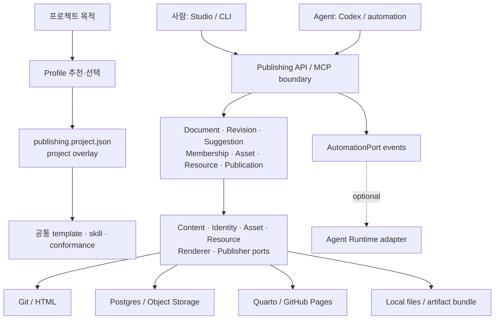

# 아키텍처

## 한 문장 구조

Project profile이 공통 contract와 adapter 조합을 선택하고, 사람과 agent가 같은 publishing boundary를 통과하도록 하는 versioned kit입니다.



점선은 선택적 관계입니다. Agent Runtime은 domain과 adapter의 실행 전제조건이 아닙니다.

## 현재 구현과 목표

| 영역 | 현재 `v0.1-alpha` | 목표 |
|---|---|---|
| Contract | TypeScript domain types와 manifest validation | versioned API/MCP schema와 conformance |
| Profile | 5개 profile, capability/adapter defaults | 실사용 evidence 기반 profile lifecycle |
| Project factory | recommend/init/doctor, overwrite 방지, checksum | update plan/diff/apply와 migration |
| UI/API | 미구현 | shared Studio와 Publishing API |
| Adapter | selection contract만 구현 | Git, Postgres, Quarto, local reference adapters |
| Agent | bootstrap skill | Publishing MCP skill과 승인 workflow |
| Runtime | `AutomationPort`/event만 구현 | 조건부 Agent Runtime adapter |

## Contract map

### Document와 revision

- 모든 update는 `baseRevisionId`, `idempotencyKey`, `editSummary`, `direct|propose` mode를 가진다.
- revision은 append-only이며 restore도 새 revision을 만든다.
- revision 불일치는 overwrite가 아니라 rebase preview 또는 conflict가 된다.
- 새 rich-text 프로젝트의 block ID는 내용 hash가 아닌 persistent UUID를 사용한다.

### Suggestion

제안 위치는 `revisionId + blockId + exact + prefix + suffix`로 표현합니다. from/to offset은 힌트이며 단독 source of truth가 아닙니다. lifecycle은 `open → accepted/rejected/outdated → published`를 구분합니다.

### Identity와 account

로그인 identity, project membership/role, 외부 Git 또는 배포 credential은 별도 모델입니다. 브라우저에 service credential을 노출하지 않고, UI 숨김이 아닌 server capability 판정으로 권한을 집행합니다.

### Asset와 Resource

- Asset: 업로드된 binary와 derivative lineage. `staged → scanning → ready → quarantined/rejected`.
- Resource: version, visibility, 관계, domain metadata가 있는 관리 대상.
- file extension만 신뢰하지 않고 size, signature, checksum, malware policy, attribution을 검사합니다.
- 참조가 있는 항목은 즉시 hard delete하지 않습니다.

### Publication

Save와 publish를 분리합니다. publish는 `validate → render → stage → current revision 재확인 → publish → live checksum/URL verify` 순서이며 재시도는 idempotent해야 합니다.

## Profile, overlay, adapter의 경계

```text
한 프로젝트만 다른가?             → manifest overlay
같은 capability bundle이 반복되는가? → profile
의미는 같고 외부 시스템만 다른가?    → adapter
모든 adapter가 같은 의미를 쓰는가?    → shared contract
작업 조율 규모만 커졌는가?           → AutomationPort adapter
```

프로필을 시각 테마처럼 다루지 않습니다. canonical store, permission model, editorial interaction, output boundary가 선택 기준입니다.

## Versioning

- contract/profile/template은 SemVer를 따른다.
- 상태는 `experimental → stable → deprecated → removed`입니다.
- breaking change에는 구계약/신계약, 영향 consumer, migration, deprecation window, rollback, owner를 기록합니다.
- `.epk/state.json`은 생성 당시 kit version과 managed-file checksum을 보존합니다.
- 향후 update 명령은 로컬 수정이 있는 파일을 자동 overwrite하지 않고 plan/diff/merge를 요구합니다.

## Trust boundaries

- project manifest에는 secret을 넣지 않습니다.
- fork PR 검증은 deploy credential 없이 read-only로 실행합니다.
- publish, rollback, quarantine apply, membership role 변경은 plan/preview와 명시적 승인을 요구합니다.
- 로컬 tutorial data는 adapter 존재만으로 외부 전송되지 않습니다.
