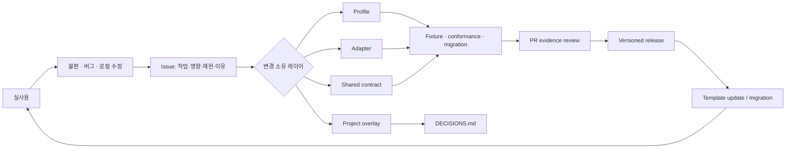

# 기여 피드백 루프

## 왜 “수정 이유”가 핵심인가

서로 다른 프로젝트가 같은 template을 복사한 뒤 조용히 고치면 공통 기반은 금방 갈라집니다. 반대로 모든 차이를 금지하면 현장 요구를 막습니다. 이 프로젝트는 차이를 허용하되, 이유와 증거를 회수해서 올바른 공통 레이어로 승격합니다.

## 흐름

## Issue에 필요한 정보

- kit version과 project profile
- 사용자가 하려던 실제 작업
- 가장 작은 재현
- 기대/실제 결과와 영향
- 로컬에서 바꾼 diff 또는 설명
- 기본값이 부족했던 이유
- secret, private content, 개인정보를 제거한 증거

버그는 재현 가능해야 하고, feature는 solution보다 recurring problem을 먼저 설명해야 합니다. 로컬 수정이 이미 있다면 그 코드보다 “왜 그 수정이 필요했는가”가 더 중요합니다.

## 분류 규칙

| 관찰 | 기본 처리 |
|---|---|
| endpoint, visibility처럼 한 프로젝트만 다른 정책 | project overlay + decision |
| 같은 capability와 제약 조합이 여러 프로젝트에서 반복 | profile default |
| 외부 storage/renderer/provider만 다르고 의미가 같음 | adapter |
| revision, suggestion, asset lifecycle의 의미가 달라야 함 | shared contract 검토 + ADR |
| 반복되는 수동 점검 | executable check 또는 conformance fixture |
| 동시 agent/worktree 조율 문제 | automation/runtime 검토 |

## PR evidence

변경 영향에 비례해 다음을 요구합니다.

- 문제와 recurring semantic role
- authoritative source
- 영향 profile/adapter/consumer
- 호환성, migration, rollback
- unit/contract/conformance 결과
- rendered output을 바꿨다면 안정된 조건의 preview/diff
- accessibility, security, privacy, cross-format 영향
- accepted exception과 제거/재검토 시점

“더 깔끔해 보인다”만으로 shared contract를 바꾸지 않습니다. 독자, 저자, 운영자 또는 개발자에게 어떤 불일치와 비용이 있었는지 설명합니다.

## 처리 상태

`needs-triage → accepted/needs-design → in-progress → released`를 기본 흐름으로 사용합니다. 중복, project-only, declined도 이유를 남기고 닫습니다. 보안 취약점은 공개 Issue 대신 `SECURITY.md` 경로를 사용합니다.

## 피드백 SLA

초기 공개 프로젝트에서는 엄격한 시간 약속보다 상태 투명성을 우선합니다.

- triage 시 profile/area/impact를 지정합니다.
- 재현이 부족하면 필요한 최소 증거를 구체적으로 요청합니다.
- accepted change는 milestone 또는 후속 Issue에 연결합니다.
- 긴 설계는 ADR을 만들고 Issue에서 결정을 링크합니다.
- 릴리스되면 원 Issue에 version과 migration을 남깁니다.
